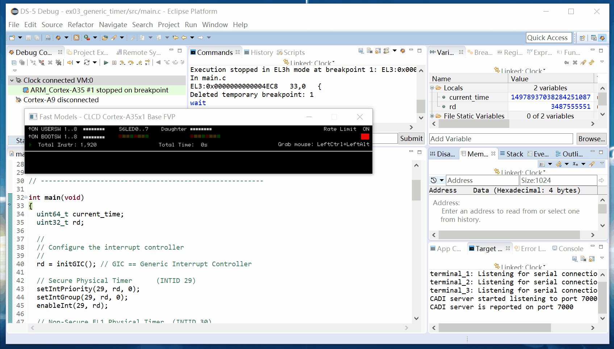

# GZHU ESiT Arm DS-5 Workspace

广州大学 ESiT 课程中的练习代码。

课程中使用的 IDE 是 Arm DS-5 v5.26.0。

## ex01

点亮属于你的 LED 走马灯吧！

## ex02

循环和内存操作、反向走马灯与 UART 和 Telnet。

## ex03_generic_timer

让时钟为你产生中断！

## fin_clock

Todo

---

## Post Scriptum

> 中二描述由 @lightyears1998 为您呈现。
> 这一定是黑历史。
